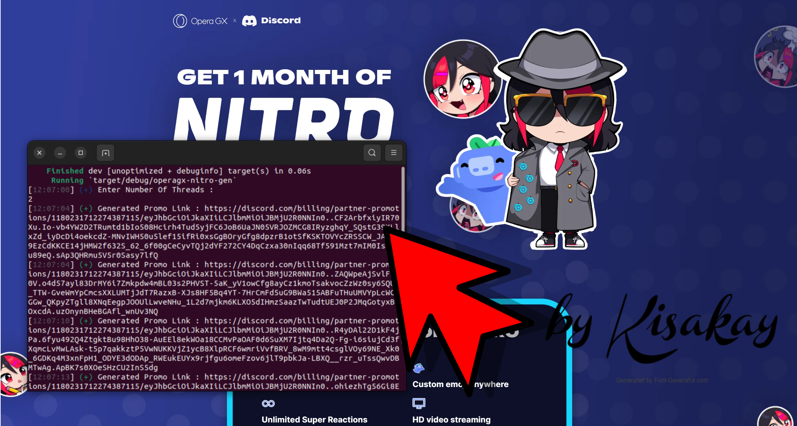

# OperaGX Discord Nitro Generator


Edited with KolourPaint lmao

An abusive generator of Discord Nitro with special OperaGX promotions!

## Does it really work?

Yes, this program does work. The code of the program is based on the new collaborations between Discord and OperaGX. These new features allow giving Discord Nitro Boost promotions to users who use the famous browser called "Opera GX"!

In the original story of this wonderful collaboration, you need to use the OperaGX browser to claim your reward. However, a browser is identified by its User-Agent. This program tweaks the behaviors of the backend instance to generate a Discord Nitro promotion.

The program recommends using proxies. For this part, you can use Webshare.io, a powerful and cost-effective proxy provider.

## Why choose Rust?

I chose Rust because, until now, the only "OperaGX Discord Nitro Generator" was made in Python. Python is known for its poorly optimized and sometimes broken logic. Rust, being a low-level language, offers efficiency and speed, unlike Python.

## How to use this software?

Before anything else, you need to install Rust on your computer (available on Windows/Linux/macOS). [Get started with Rust](https://www.rust-lang.org/learn/get-started)

### Case: Using WebShare Proxy

If you are using WebShare proxy, you need to convert the .txt files of the proxy into the correct format for the program. I have created the "proxy_scrapper/webshare" program to convert them automatically.

1. Go to the root project folder:

    ```bash
    user@os:~/home/OperaGX-DiscordNitro-Gen$ cd proxy_parser
    ```

2. Set your WebShare proxy in the `proxies.txt` file. Rename `proxies.example.txt` to `proxies.txt` and insert your fresh proxies.

3. Move to the `webshare` folder:

    ```bash
    user@os:~/home/OperaGX-DiscordNitro-Gen/proxy_parser$ cd webshare
    ```

4. Compile and run it:

    ```bash
    user@os:~/home/OperaGX-DiscordNitro-Gen/proxy_parser/webshare$ cargo run
    ```

    The program creates an `output.txt` file in the current directory `/home/OperaGX-DiscordNitro-Gen/proxy_parser/`. Move this file to the root project directory `/home/OperaGX-DiscordNitro-Gen/proxies.txt`.

### Case: Using another service than Webshare

I'm sorry; for now, the repository doesn't have another parser. You need to parse the data yourself! Contributions are appreciated to improve the parser.

## Running the generator (main program):

Now you need to be in the root project's directory. Compile and run the program with the following command:

```bash
user@os:~/home/OperaGX-DiscordNitro-Gen$ cargo run
```

### Features:

- You can choose the number of threads you want (more threads require more resources).
- The program automatically writes the promotion codes to `promos.txt` in the current directory.
- The program informs you when a proxy is being rate-limited.
- Error handling in the console.

Stay tuned! Follow me or star the project to get notified when changes are made!
<br>

## Star Stats


## Note

This software is designed for educational purposes exclusively. Please use it responsibly and adhere to the terms of service of both Discord and OperaGX.

## Inspiration

This project was inspired by another GitHub creator called [JOY6IX9INE](https://github.com/JOY6IX9INE) and their cool OperaGX Nitro generator. Thanks to them!

## Developed by Kisakay

And who knows, maybe more features are coming? 😜
